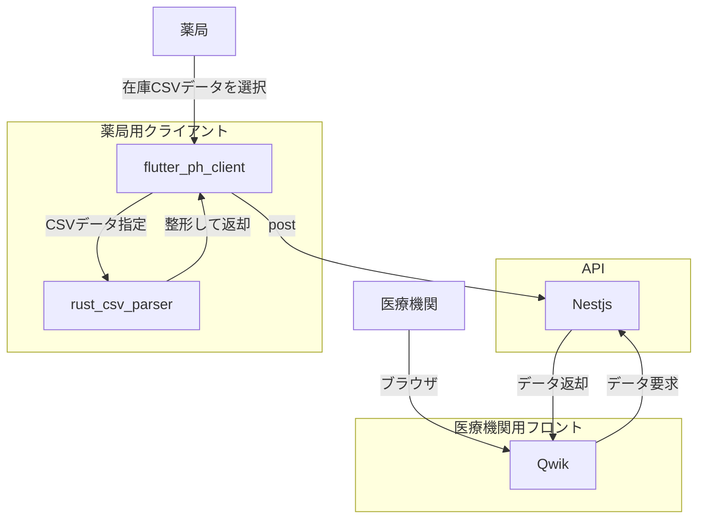

# med-publish
医療機関向けに薬局の在庫状況を共有するためのWebアプリです。  

[example](https://med-publish.pages.dev/)

## 構成

医療機関向けフロントには`Qwik`を採用しました。
かなり忙しい中で在庫を調べる場合が多いため、初期ロード時間をできるだけ短くしたいうえに、機能を持たせるためにJSが必要である状況だったため、ResumableなQwikが適していると考えました。

exampleでは医療機関用フロントは`Cloudflare Pages`にてホスティングしています。  
`qwik`には`cloudflare pages functions`のアダプターが用意されているため簡単に実装可能です。  
`.env`で下記APIのエンドポイントを指定する必要があります。

nestjsのDBにはSQLiteを選択しました。  
主応需先が閲覧できれば十分のため、SQLiteで十分です。  
バックエンドをサーバーにデプロイする際に`Dockerfile`を作成することで汎用性を高めました。  

## Dockerfileについて

マルチステージビルドを行い build 環境で Prisma Client を生成しており、production 環境には`Prisma CLI`が存在しないため注意が必要です。    
